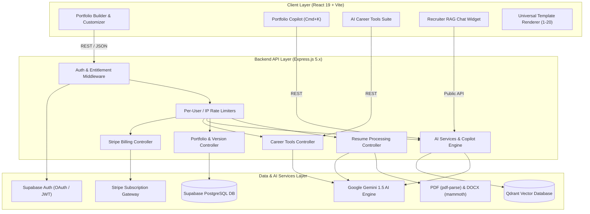
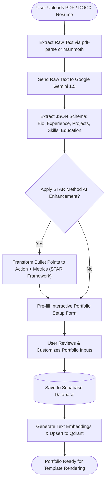
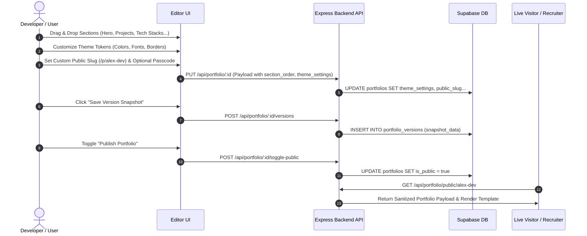
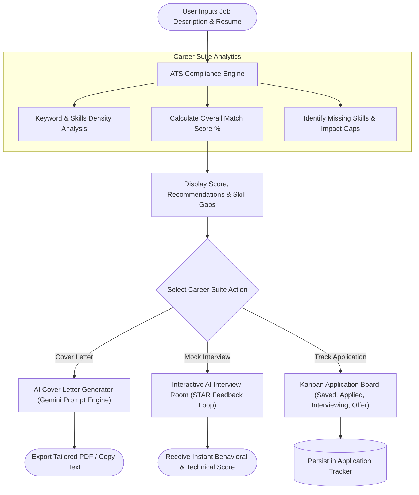
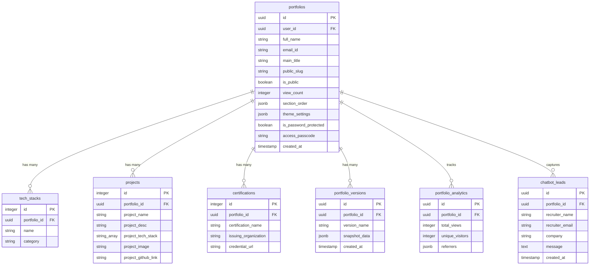

# 🚀 Portfolio.io — Next-Gen AI Portfolio Builder & Career Suite

[](LICENSE)
[](https://react.dev/)
[](https://vitejs.dev/)
[](https://nodejs.org/)
[](https://supabase.com/)
[](https://qdrant.tech/)
[](https://deepmind.google/technologies/gemini/)
[](https://tailwindcss.com/)

> **Transform raw resume files and GitHub repositories into high-converting, ATS-optimized interactive portfolio websites with RAG-powered recruiter chatbots in under 3 minutes.**

Portfolio.io is an end-to-end full-stack web platform and AI career companion built for developers, software engineers, and tech professionals. Beyond traditional static site generators, Portfolio.io pairs **20 production-grade reactive templates** with real-time visual drag-and-drop customization, **RAG-powered recruiter chatbots**, interactive **AI mock interviewers**, **ATS resume scoring**, version history snapshotting, and **Kanban application tracking**.

---

## 📋 Table of Contents

- [✨ Key Features](#-key-features)
- [📊 Flowcharts & System Diagrams](#-flowcharts--system-diagrams)
  - [1. High-Level System Architecture](#1-high-level-system-architecture)
  - [2. AI Resume Parsing & STAR Optimization Flow](#2-ai-resume-parsing--star-optimization-flow)
  - [3. Recruiter RAG QA Bot & Vector Search Workflow](#3-recruiter-rag-qa-bot--vector-search-workflow)
  - [4. Portfolio Customization & Publishing Lifecycle](#4-portfolio-customization--publishing-lifecycle)
  - [5. AI Career Suite & Job Matcher Flow](#5-ai-career-suite--job-matcher-flow)
  - [6. Database Entity-Relationship Model (ERD)](#6-database-entity-relationship-model-erd)
- [🛠 Tech Stack](#-tech-stack)
- [🎨 Universal Template Engine (20 Designs)](#-universal-template-engine-20-designs)
- [📁 Repository Structure](#-repository-structure)
- [🗺 Application Routes Matrix](#-application-routes-matrix)
- [📡 API Documentation Reference](#-api-documentation-reference)
- [🚀 Getting Started](#-getting-started)
  - [Prerequisites](#prerequisites)
  - [Environment Configuration](#environment-configuration)
  - [Local Installation](#local-installation)
  - [Database Schema Setup](#database-schema-setup)
- [🧪 Testing & QA](#-testing--qa)
- [🚢 Deployment Guide](#-deployment-guide)
- [📜 License](#-license)

---

## ✨ Key Features

### 1. 📄 AI-Powered Setup & Document Parser
- **Multi-Format Extraction**: Parses raw `.pdf` and `.docx` resume files using `pdf-parse` and `mammoth`.
- **Intelligent JSON Categorization**: Automatically extracts contact details, main title, about paragraph, education history, work experience, projects, skills, and certifications into structured JSON schemas.
- **STAR Method AI Enhancer**: Uses Google Gemini 1.5 to rewrite work experience bullet points into high-impact metric-driven statements following the **Situation, Task, Action, Result** framework.

### 2. 🤖 Portfolio Copilot (`Cmd+K`) & Recruiter RAG Bot
- **Spotlight Portfolio Copilot**: Interactive command palette allowing candidates to update their portfolio using natural language (e.g. *"Add Docker to my skills"* or *"Make my bio sound more executive"*).
- **Recruiter RAG Assistant**: Every live portfolio hosts an AI assistant trained on the user's background. Backed by **Qdrant Vector Database** embeddings, recruiters can ask questions like *"Has John managed Kubernetes clusters?"* or *"What is Sarah's experience with PyTorch?"*.
- **Lead Capture Drawer**: When recruiters ask high-intent questions, the bot prompts them with a lead capture form, sending contact details directly to the candidate's analytics dashboard.

### 3. 🎨 Visual Drag-and-Drop Theme & Layout Customizer
- **Drag-and-Drop Section Reordering**: Powered by `@hello-pangea/dnd`, users can visually reorder Hero, About, Projects, Experience, Tech Stacks, Certifications, Blog Posts, and Case Studies in real-time.
- **Dynamic Theme Engine**: Tweak primary colors, accent gradients, border radii, and custom typography (Inter, Outfit, Fira Code, Playfair Display, Roboto) with zero full-page reloads.
- **Password & Passcode Protection**: Restrict access to public portfolios using secret passcodes or temporary link expiration timestamps.

### 4. 🧰 AI Career Suite & Job Tracker
- **ATS Resume Checker**: Scores resumes against ATS parsers, analyzing keyword density, section formatting, and impact metrics.
- **Smart Job Matcher**: Compare any resume or portfolio against a job description to calculate exact match percentages and highlight missing skills.
- **AI Cover Letter Generator**: Produce hyper-tailored, role-specific cover letters in seconds.
- **AI Mock Interview Room**: Real-time simulated technical/behavioral interview practice with instantaneous AI feedback and score cards.
- **Kanban Application Tracker**: Manage job applications through drag-and-drop columns (*Wishlist, Applied, Interviewing, Offer, Rejected*).

### 5. 📸 Portfolio Versioning & Analytics
- **Version History & Rollbacks**: Create named snapshot versions of portfolios and restore any historical state with one click.
- **Recruiter Visitor Analytics**: Track total page views, unique visitors, top referrer channels (LinkedIn, GitHub, Twitter), top viewed sections, and chatbot query logs.

---

## 📊 Flowcharts & System Diagrams

### 1. High-Level System Architecture

The following diagram details the end-to-end architecture connecting the React frontend, Express API layer, Supabase database, Qdrant vector engine, and Google Gemini AI services:



---

### 2. AI Resume Parsing & STAR Optimization Flow

Shows how uploaded resume documents are parsed, converted into structured JSON, polished via the STAR method, and indexed into the vector store:



---

### 3. Recruiter RAG QA Bot & Vector Search Workflow

Illustrates how recruiter inquiries on live candidate portfolios are processed using retrieval-augmented generation (RAG) and vector similarity search:

```mermaid
flowchart LR
    Recruiter([Recruiter / Visitor]) -->|Types Question| ChatWidget["RAG Chat Widget (/p/:slug)"]
    ChatWidget -->|POST /api/ai/chat/:portfolioId| VectorSearch["Query Qdrant Vector Store"]
    
    subgraph Vector Retrieval Engine
        VectorSearch -->|Top-K Similarity| ContextDocs["Retrieve Relevant Portfolio Chunks"]
    end

    ContextDocs --> PromptAugment["Augment Gemini Prompt with Context + Strict Guardrails"]
    PromptAugment --> GeminiLLM["Google Gemini 1.5 LLM Inference"]
    GeminiLLM --> StreamReply["Stream Response to Recruiter Chat Window"]
    
    StreamReply --> LeadTrigger{Recruiter Expresses Hiring Interest?}
    LeadTrigger -- Yes --> LeadModal["Display Recruiter Lead Capture Form"]
    LeadModal --> SaveLead[(Store Lead in Supabase chatbot_leads)]
    LeadTrigger -- No --> EndChat([Continue Conversation])
```



---

### 4. Portfolio Customization & Publishing Lifecycle

Details the step-by-step state changes during theme modification, section reordering, version snapshotting, and public URL publishing:



---

### 5. AI Career Suite & Job Matcher Flow

Demonstrates the workflow for ATS compliance checks, job description matching, cover letter generation, and mock interview practice:



---

### 6. Database Entity-Relationship Model (ERD)

Maps out the primary tables and relationships within the Supabase PostgreSQL database:



---

## 🛠 Tech Stack

| Layer | Technology | Key Capabilities & Use Cases |
|---|---|---|
| **Frontend Framework** | React 19 + Vite 6 | Lightning-fast HMR, concurrent rendering, modular single-page app |
| **Routing & Navigation** | React Router v7 | Nested layouts, protected routes, public slug handling |
| **Styling & UI Tokens** | Tailwind CSS v4 + Custom CSS | CSS variables design system, glassmorphism, responsive bento grids |
| **Animations & Effects** | Framer Motion + GSAP | Micro-interactions, scroll-driven entrance triggers, spring physics |
| **Drag & Drop** | `@hello-pangea/dnd` | Reorderable section lists in editor UI |
| **Backend Runtime** | Node.js (ES Modules) | Asynchronous non-blocking architecture |
| **Web Framework** | Express.js 5.x | RESTful API routes, rate-limiting middleware, CORS handling |
| **Primary Database** | Supabase (PostgreSQL) | Relational data storage, Row-Level Security, snapshot JSONB |
| **Authentication** | Supabase Auth + JWT | Google & GitHub OAuth 2.0, email/password OTP authentication |
| **Vector DB (RAG)** | Qdrant Vector Engine | Cosine similarity vector search for candidate background QA |
| **AI LLM Engine** | Google Gemini 1.5 / Flash | Resume parsing, STAR text enhancement, interview evaluation |
| **Document Processing**| `pdf-parse`, `mammoth` | Extraction of raw text from PDF and DOCX uploads |
| **Billing & Payments** | Stripe API | Pro subscription checkout sessions and customer portal |

---

## 🎨 Universal Template Engine (20 Designs)

Portfolio.io includes 20 production-ready visual templates catering to distinct design sensibilities:

| # | Template Name | Aesthetic Style | Typography & Palette |
|---|---|---|---|
| **01** | **Modern Minimalist** | Clean whitespace, subtle cards, bento grid layout | Inter, Slate & Indigo |
| **02** | **Bold Display** | High-contrast dark typography with large hero focus | Outfit, Pitch Black & Off-White |
| **03** | **Glassmorphism Aurora** | Ambient dark blur effects, vibrant neon glows | Inter, Aurora Purple & Cyan |
| **04** | **Neon Cyberpunk** | Dark terminal aesthetic, cyan/fuchsia neon lines | Fira Code, Fuchsia & Electric Cyan |
| **05** | **Retro Arcade 8-Bit** | Pixel-art badges, CRT scanlines, 90s gaming vibe | Press Start 2P, Arcade Red & Gold |
| **06** | **Editorial Magazine** | Serif typography, broadsheet grid, clean beige borders | Playfair Display, Warm Cream & Ink Black |
| **07** | **Blueprint Technical** | Navy grid paper, technical metrics, monospaced details | Fira Code, Blueprint Navy & White |
| **08** | **Clean Executive** | Corporate slate, executive summary focus, metric pills | Roboto, Executive Steel & Navy |
| **09** | **Neo Brutalism** | High-contrast borders, solid drop shadows, raw aesthetic | Space Grotesk, Canary Yellow & Solid Black |
| **10** | **Terminal Matrix** | Hacker console, green Matrix code animations, dark CLI | Monospace, CRT Green & Pitch Black |
| **11** | **Soft Claymorphism** | Soft 3D pastel cards, tactile pill buttons | Inter, Pastel Pink & Sky Blue |
| **12** | **AI Cyberpunk** | Futuristic dark mode, glowing AI status badges | Outfit, Deep Space & Emerald Green |
| **13** | **Sage Botanical** | Organic sage green palette, warm cream cards | Lora, Sage Green & Soft Beige |
| **14** | **Newspaper Broadsheet** | Classic black & white print layout with drop caps | Georgia, Newsprint Monochrome |
| **15** | **Constructivist Swiss** | Bold red & black geometric blocks, grid typography | Helvetica / Inter, Swiss Red & Charcoal |
| **16** | **Tactical HUD** | Sci-fi telemetry layout with sensor grids & charts | Orbitron / Fira Code, Cyber Amber & Obsidian |
| **17** | **Vaporwave Retrowave** | 80s synthwave pink/purple dual-tone gradients | Outrun Synth, Vapor Pink & Violet |
| **18** | **Titanium Monolith** | Sleek dark slate glass panels, metallic typography | Inter, Dark Titanium & Silver Accent |
| **19** | **Nordic Light** | Scandinavian minimalist cream, ultra-clean layout | Plus Jakarta Sans, Sand & Warm Gray |
| **20** | **Obsidian Gold** | Luxury dark layout with champagne gold accents | Playfair Display, Obsidian Black & Gold |

---

## 📁 Repository Structure

```
portfolio/
├── backend/
│   ├── src/
│   │   ├── ai/                      # AI controller & Gemini prompt orchestrator
│   │   ├── chat/                    # RAG Recruiter chat controller & vector search
│   │   ├── config/                  # Supabase & Qdrant configuration modules
│   │   ├── controllers/             # Auth, Portfolio, Resume, Billing, Career controllers
│   │   ├── middleware/              # Auth, Entitlement, Rate Limiters
│   │   ├── routes/                  # Express routing modules (auth, ai, portfolio, etc.)
│   │   ├── services/                # Background helper services
│   │   ├── utils/                   # File & text transformation utilities
│   │   └── server.js                # Express app entry point
│   ├── supabase-schema.sql          # PostgreSQL database schema & migration script
│   └── package.json
├── frontend/
│   └── vite-project/
│       ├── src/
│       │   ├── components/          # Reusable UI controls, Navbar, Footers, Form modules
│       │   ├── contexts/            # Auth, Theme, Portfolio React Context providers
│       │   ├── hooks/               # Custom hooks (useAuth, usePortfolio, useCopilot)
│       │   ├── pages/               # Page views (Dashboard, Builder, ATS, Career, Public View)
│       │   ├── Templates/           # 20 Universal Reactive Portfolio Templates
│       │   ├── App.jsx              # React router configuration & root providers
│       │   └── main.jsx             # React DOM root entry point
│       ├── index.html
│       ├── vite.config.js
│       └── package.json
├── render.yaml                      # Render PaaS deployment configuration
├── vercel.json                      # Vercel static deployment configuration
└── README.md
```

---

## 🗺 Application Routes Matrix

| Frontend Route | Description | Auth Requirement | Plan Access |
|---|---|---|---|
| `/` | Landing page & hero presentation | Public | All |
| `/login` | Email/password & OAuth login | Public | All |
| `/register` | User signup & profile creation | Public | All |
| `/home` | Hero dashboard & live demo switcher | Protected | All |
| `/viewtemplates` | Template gallery (Templates 1-20) | Protected | All |
| `/my-portfolios` | Portfolio management & snapshot dashboard | Protected | All |
| `/provide-data/:templateId` | AI Resume upload & portfolio builder form | Protected | All |
| `/edit-portfolio/:portfolioId`| Real-time visual customizer & section reorderer | Protected | All |
| `/ats-checker` | ATS Resume scanner & optimization report | Protected | All |
| `/career-tools` | Career Suite hub | Protected | All |
| `/cover-letter` | AI Cover letter generator | Protected | Pro |
| `/mock-interview` | Interactive AI mock interview simulator | Protected | Pro |
| `/job-tracker` | Application Kanban board | Protected | Pro |
| `/analytics` | Recruiter visit analytics & lead table | Protected | Pro |
| `/pricing` | Subscription plan comparisons | Public / Protected | All |
| `/p/:slug` | Public candidate portfolio view | Public | All |

---

## 📡 API Documentation Reference

### Authentication Endpoints

```http
POST /api/auth/signup
Content-Type: application/json

{
  "email": "dev@example.com",
  "password": "SecurePassword123!",
  "fullName": "Alex Developer"
}
```

```http
POST /api/auth/login
Content-Type: application/json

{
  "email": "dev@example.com",
  "password": "SecurePassword123!"
}
```

---

### Resume & AI Endpoints

```http
POST /api/resume/autofill
Content-Type: multipart/form-data

form-data: resume = [File: alex_resume.pdf]
```
**Response Sample**:
```json
{
  "full_name": "Alex Developer",
  "email_id": "alex@example.com",
  "main_title": "Full-Stack Software Engineer",
  "about_paragraph": "Experienced engineer specializing in React, Node.js, and AI applications.",
  "tech_stacks": ["React", "Node.js", "TypeScript", "PostgreSQL", "Docker"],
  "projects": [
    {
      "project_name": "AI Portfolio Suite",
      "project_desc": "Built an automated portfolio generator using Gemini 1.5 and Qdrant.",
      "project_tech_stack": ["React", "Express", "Qdrant"]
    }
  ]
}
```

```http
POST /api/ai/copilot
Authorization: Bearer <JWT_TOKEN>
Content-Type: application/json

{
  "portfolioId": "uuid-here",
  "command": "Add TypeScript to tech stack and optimize experience bullet points"
}
```

```http
POST /api/ai/chat/:portfolioId
Content-Type: application/json

{
  "message": "What experience does Alex have with vector databases?"
}
```

---

### Portfolio Management Endpoints

```http
PUT /api/portfolio/:id
Authorization: Bearer <JWT_TOKEN>
Content-Type: application/json

{
  "theme_settings": {
    "primaryColor": "#6366f1",
    "fontFamily": "Outfit",
    "borderRadius": "12px"
  },
  "section_order": ["hero", "projects", "tech_stacks", "about", "certifications"]
}
```

```http
POST /api/portfolio/:id/versions
Authorization: Bearer <JWT_TOKEN>
Content-Type: application/json

{
  "versionName": "v1.2 - Post-Interview Update"
}
```

---

## 🚀 Getting Started

### Prerequisites
- **Node.js**: `v18.x` or `v20.x`
- **npm**: `v9.x` or higher
- **Docker**: (Optional, required only for local Qdrant Vector DB instance)
- **Supabase Account**: Active project with database access
- **Google Gemini API Key**: API key from Google AI Studio

---

### Environment Configuration

#### 1. Backend Environment (`backend/.env`)
Create a `.env` file in the `backend/` directory:

```env
PORT=5000
NODE_ENV=development
FRONTEND_URL=http://localhost:5173

# JWT Secret Key
JWT_SECRET=your_super_secret_jwt_key_here

# Supabase Configuration
SUPABASE_URL=https://your-supabase-project.supabase.co
SUPABASE_ANON_KEY=your_supabase_anon_key
SUPABASE_SERVICE_ROLE_KEY=your_supabase_service_role_key

# Google Gemini API
GEMINI_API_KEY=your_google_gemini_api_key

# Qdrant Vector Database
QDRANT_URL=http://localhost:6333
QDRANT_API_KEY=optional_qdrant_cloud_key

# Optional: Stripe Integration
STRIPE_SECRET_KEY=sk_test_your_stripe_key
STRIPE_WEBHOOK_SECRET=whsec_your_webhook_secret
```

#### 2. Frontend Environment (`frontend/vite-project/.env`)
Create a `.env` file in `frontend/vite-project/`:

```env
VITE_API_URL=http://localhost:5000/api
VITE_SUPABASE_URL=https://your-supabase-project.supabase.co
VITE_SUPABASE_ANON_KEY=your_supabase_anon_key
```

---

### Local Installation

#### Step 1: Clone the repository
```bash
git clone https://github.com/ishanbagra18/portfolio.ai.git
cd portfolio
```

#### Step 2: Start Qdrant Vector DB via Docker (Optional)
```bash
docker run -d -p 6333:6333 -p 6334:6334 -v qdrant_storage:/qdrant/storage qdrant/qdrant
```

#### Step 3: Install & Start Backend
```bash
cd backend
npm install
node src/server.js
```
*Backend API will run on `http://localhost:5000`.*

#### Step 4: Install & Start Frontend
```bash
cd ../frontend/vite-project
npm install
npm run dev
```
*Frontend client will run on `http://localhost:5173`.*

---

### Database Schema Setup

1. Open your [Supabase Dashboard](https://database.new).
2. Navigate to **SQL Editor**.
3. Copy the contents of [`backend/supabase-schema.sql`](file:///c:/Users/ishan/Desktop/portfolio/backend/supabase-schema.sql) and execute the queries.
4. This will create the required `portfolios`, `tech_stacks`, `projects`, `certifications`, `portfolio_versions`, `portfolio_analytics`, and `chatbot_leads` tables.

---

## 🧪 Testing & QA

Run backend test suites:

```bash
cd backend
npm test
```

The test runner covers API authentication routes, AI controller input validation, and middleware rate-limiting protection.

---

## 🚢 Deployment Guide

### Deploying Frontend on Vercel
1. Link your GitHub repository to Vercel.
2. Set root directory to `frontend/vite-project`.
3. Add environment variables: `VITE_API_URL`, `VITE_SUPABASE_URL`, `VITE_SUPABASE_ANON_KEY`.
4. Deploy!

### Deploying Backend on Render
1. Create a new Web Service on Render pointing to your repository.
2. Select Node.js runtime.
3. Set build command: `cd backend && npm install`
4. Set start command: `node backend/src/server.js`
5. Populate environment variables in Render Dashboard.

---

## 📜 License

Distributed under the MIT License. See [LICENSE](LICENSE) for more details.

---

*Crafted with ❤️ by Ishan Bagra & The Portfolio.io Engineering Team*
