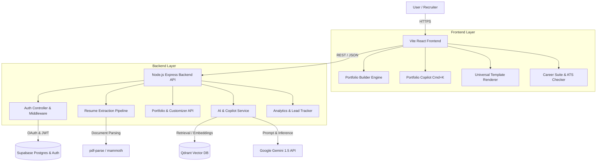

# 🚀 Portfolio.io — Next-Gen AI Portfolio Builder & Career Suite

[](LICENSE)
[](https://react.dev/)
[](https://vitejs.dev/)
[](https://nodejs.org/)
[](https://supabase.com/)
[](https://qdrant.tech/)
[](https://deepmind.google/technologies/gemini/)
[](https://tailwindcss.com/)

**Transform raw resume files and GitHub repositories into high-converting, ATS-optimized interactive portfolio websites in under 3 minutes.**

Portfolio.io is an end-to-end web platform and AI career companion designed for developers, designers, and tech talent. It goes far beyond static site generators by pairing 20 production-grade reactive templates with real-time visual customizers, RAG-powered recruiter chatbots, interactive AI mock interviewers, ATS resume scoring, and live application tracking.

---

## 📋 Table of Contents

- [Key Features](#-key-features)
  - [1. AI-Powered Setup & Parser](#1-ai-powered-setup--parser)
  - [2. Universal Template Engine (20 Designs)](#2-universal-template-engine-20-designs)
  - [3. Portfolio Copilot & Recruiter RAG Bot](#3-portfolio-copilot--recruiter-rag-bot)
  - [4. Real-time Theme & Layout Customizer](#4-real-time-theme--layout-customizer)
  - [5. AI Career Suite & Job Application Tools](#5-ai-career-suite--job-application-tools)
  - [6. Analytics, Pro Entitlements & Sharing](#6-analytics-pro-entitlements--sharing)
- [Architecture & Data Flow](#-architecture--data-flow)
- [Tech Stack](#-tech-stack)
- [Application Routes](#-application-routes)
- [Getting Started](#-getting-started)
  - [Prerequisites](#prerequisites)
  - [Environment Configuration](#environment-configuration)
  - [Local Installation](#local-installation)
- [API Documentation](#-api-documentation)
- [License](#-license)

---

## ✨ Key Features

### 1. AI-Powered Setup & Parser
- **PDF & DOCX Resume Parsing**: Multi-stage text extraction using `pdf-parse` and `mammoth`. Automatically categorizes personal info, work experience, projects, skills, education, and certifications into structured JSON schemas.
- **STAR Method AI Enhancer**: Rewrites work bullet points into impactful action statements using the Situation, Task, Action, Result framework via Google Gemini 1.5.

### 2. Universal Template Engine (20 Designs)

A curated collection of 20 fully responsive, reactive templates engineered with Tailwind CSS, Framer Motion, and GSAP:

| # | Template Name | Visual Style & Theme Focus |
|---|---|---|
| **01** | Modern Minimalist | Clean white space, subtle cards, bento grid layout |
| **02** | Bold Display | High-contrast dark typography with large hero focus |
| **03** | Glassmorphism Aurora | Ambient dark blur effects, vibrant neon glows |
| **04** | Neon Cyberpunk | Dark terminal aesthetic, cyan/fuchsia neon lines |
| **05** | Retro Arcade 8-Bit | Pixel-art badges, CRT scanlines, 90s gaming vibe |
| **06** | Editorial Magazine | Serif typography, broadsheet grid, clean beige borders |
| **07** | Blueprint Technical | Navy grid paper, technical metrics, monospaced details |
| **08** | Clean Executive | Corporate slate, executive summary focus, metric pills |
| **09** | Neo Brutalism | High-contrast borders, solid drop shadows, raw aesthetic |
| **10** | Terminal Matrix | Hacker console, green Matrix code animations, dark CLI |
| **11** | Soft Claymorphism | Soft 3D pastel cards, tactile pill buttons |
| **12** | AI Cyberpunk | Futuristic dark mode, glowing AI status badges |
| **13** | Sage Botanical | Organic sage green palette, warm cream cards |
| **14** | Newspaper Broadsheet | Classic black & white print layout with drop caps |
| **15** | Constructivist Swiss | Bold red & black geometric blocks, grid typography |
| **16** | Tactical HUD | Sci-fi telemetry layout with sensor grids & charts |
| **17** | Vaporwave Retrowave | 80s synthwave pink/purple dual-tone gradients |
| **18** | Titanium Monolith | Sleek dark slate glass panels, metallic typography |
| **19** | Nordic Light | Scandinavian minimalist cream, ultra-clean layout |
| **20** | Obsidian Gold | Luxury dark layout with champagne gold accents |

---

### 3. Portfolio Copilot & Recruiter RAG Bot
- **Portfolio Copilot (`Cmd+K`)**: Floating spotlight command bar and slide-out chat drawer. Understands natural language requests (e.g., *"Add TypeScript to my skills"*, *"Make my summary sound more executive"*), presents confirmation previews, and updates portfolio state directly.
- **Recruiter RAG Assistant**: Every live portfolio hosts an AI assistant trained on the candidate's exact background. Backed by **Qdrant Vector Database** embeddings, allowing recruiters to ask questions like *"Has John worked with microservices?"* or *"What is Sarah's experience with PyTorch?"*.

---

### 4. Real-time Theme & Layout Customizer
- **Drag-and-Drop Section Reordering**: Instantly reorder sections (Hero, About, Experience, Projects, Skills, Certifications) across all 20 templates with live drag-and-drop.
- **Live Theme Customizer**: Adjust primary colors, accent gradients, typography fonts (Inter, Roboto, Fira Code, Outfit, Playfair), and border radii with real-time reactive previews.
- **Dark / Light Mode Support**: Seamless toggle with custom CSS variable mapping.

---

### 5. AI Career Suite & Job Application Tools
- **ATS Resume Checker**: Analyzes resumes against ATS formatting rules, density keywords, and role expectations. Returns a overall ATS match score and action points.
- **Smart Job Matcher**: Input any job description to evaluate direct match percentage, identify missing skills, and receive tailored suggestions.
- **AI Cover Letter Generator**: Generates customized cover letters tailored to specific job titles and company profiles.
- **AI Mock Interviewer**: Interactive simulated interview room with role-specific technical/behavioral questions and instant AI feedback on answers.
- **Kanban Job Application Tracker**: Organize application stages (Saved, Applied, Interviewing, Offer, Rejected) with drag-and-drop workflow management.

---

### 6. Analytics, Pro Entitlements & Sharing
- **Portfolio Visitor Analytics**: Track total page views, recruiter engagement, template popularity, and unique visitor trends.
- **Custom Slugs & Watermarking**: Unique shareable URLs (e.g. `/p/alex-fullstack`). Free portfolios feature a subtle *"Built with Portfolio.io"* badge with lead capture drawers.
- **Pro Gating & Tier Management**: Entitlement middleware enforcing plan limits (Free vs Pro) for analytics, unlimited custom domains, and advanced AI copilot uses.

---

## 🏗 Architecture & Data Flow



## 🛠 Tech Stack

**Frontend**
- **Framework:** React 19 (Vite)
- **Routing:** React Router v7
- **Styling:** Tailwind CSS v4, Vanilla CSS Design Tokens
- **Animations:** Framer Motion, GSAP (GreenSock Animation Platform)
- **Icons & Fonts:** Lucide React, Fontsource (Inter, Outfit, Fira Code, Playfair Display)
- **Drag & Drop:** `@hello-pangea/dnd`

**Backend**
- **Runtime:** Node.js (ES Modules)
- **Framework:** Express.js 5.x
- **Authentication:** Supabase Auth (Google & GitHub OAuth 2.0) + Custom JWT (jsonwebtoken)
- **Document Processing:** `pdf-parse`, `mammoth`

**Databases & AI**
- **Database:** Supabase (PostgreSQL)
- **Vector Search Engine:** Qdrant Database (RAG Vector Store)
- **LLM Engine:** Google Gemini 1.5 / Flash via `@google/genai` & LangChain

---

## 🗺 Application Routes

| Path | Description | Access Level |
|---|---|---|
| `/` | Landing page redirect | Public |
| `/login` | User login (Password & OAuth) | Public |
| `/register` | Create account | Public |
| `/auth/callback` | OAuth redirect handler | Public |
| `/home` | Hero dashboard & live demo switcher | Protected |
| `/viewtemplates` | Template gallery (20 templates) | Protected |
| `/my-portfolios` | Portfolio management dashboard | Protected |
| `/provide-data/:templateId` | AI Resume Upload & Form | Protected |
| `/edit-portfolio/:portfolioId` | Portfolio Editor & Customizer | Protected |
| `/ats-checker` | ATS Resume Scanner & Optimizer | Protected |
| `/career-tools` | Career Suite hub | Protected |
| `/cover-letter` | AI Cover Letter Generator | Protected |
| `/mock-interview` | AI Mock Interview Simulator | Protected |
| `/job-tracker` | Application Kanban Tracker | Protected |
| `/analytics` | Visitor & Lead Analytics | Protected (Pro) |
| `/pricing` | Plan comparisons & upgrades | Public / Protected |
| `/p/:slug` | Live Published Portfolio | Public |
| `/portfolio/template:id/:portfolioId` | Template Renderers (1-20) | Public / Protected |

---

## 🚀 Getting Started

### Prerequisites
- **Node.js**: v18.x or higher
- **npm**: v9.x or higher
- **Docker**: Optional (for running Qdrant Vector DB locally)
- **API Keys**: Google Gemini API key, Supabase project credentials

### Environment Configuration

**1. Backend .env (`backend/.env`)**
```env
PORT=5000
NODE_ENV=development
# JWT Secret
JWT_SECRET=your_jwt_secret_key_here
# Supabase Credentials
SUPABASE_URL=[https://your-supabase-project.supabase.co](https://your-supabase-project.supabase.co)
SUPABASE_ANON_KEY=your_supabase_anon_key
SUPABASE_SERVICE_ROLE_KEY=your_supabase_service_role_key
# Google Gemini AI Key
GEMINI_API_KEY=your_google_gemini_api_key
# Qdrant Vector DB
QDRANT_URL=http://localhost:6333
QDRANT_API_KEY=optional_qdrant_api_key
```

**2. Frontend .env (`frontend/vite-project/.env`)**
```env
VITE_API_URL=http://localhost:5000/api
VITE_SUPABASE_URL=[https://your-supabase-project.supabase.co](https://your-supabase-project.supabase.co)
VITE_SUPABASE_ANON_KEY=your_supabase_anon_key
```

### Local Installation

**1. Clone the repository**
```bash
git clone [https://github.com/ishanbagra18/portfolio.ai.git](https://github.com/ishanbagra18/portfolio.ai.git)
cd portfolio
```

**2. Start Qdrant Vector DB (Docker)**
```bash
docker run -d -p 6333:6333 -p 6334:6334 -v qdrant_storage:/qdrant/storage qdrant/qdrant
```

**3. Setup & Start Backend Server**
```bash
cd backend
npm install
node src/server.js
```
*The backend server will run on `http://localhost:5000`.*

**4. Setup & Start Frontend App**
```bash
cd ../frontend/vite-project
npm install
npm run dev
```
*The React client will run on `http://localhost:5173`.*

---

## 📑 API Documentation Summary

### Endpoints Overview
- `POST /api/auth/register` — User signup with email/password.
- `POST /api/auth/login` — User authentication returning JWT token.
- `POST /api/auth/oauth` — Sync OAuth profile data from Supabase.
- `POST /api/resume/parse` — Extract structured JSON from PDF/DOCX file.
- `POST /api/portfolio/create` — Store portfolio configuration & template metadata.
- `PUT /api/portfolio/update/:id` — Update portfolio details & customized theme settings.
- `GET /api/portfolio/public/:slug` — Fetch public portfolio payload by slug.
- `POST /api/ai/copilot` — Context-aware AI Copilot command processing.
- `POST /api/ai/rag-chat` — Recruiter vector-search QA stream.
- `POST /api/ai/ats-scan` — ATS compliance & keyword match scoring.

---

## 📜 License
Distributed under the MIT License. See [LICENSE](LICENSE) for more information.

*Crafted with ❤️ by Ishan Bagra & The Portfolio.io Team*
